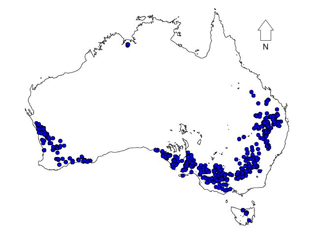
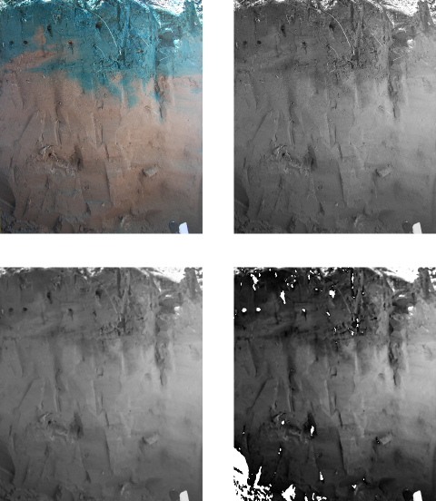
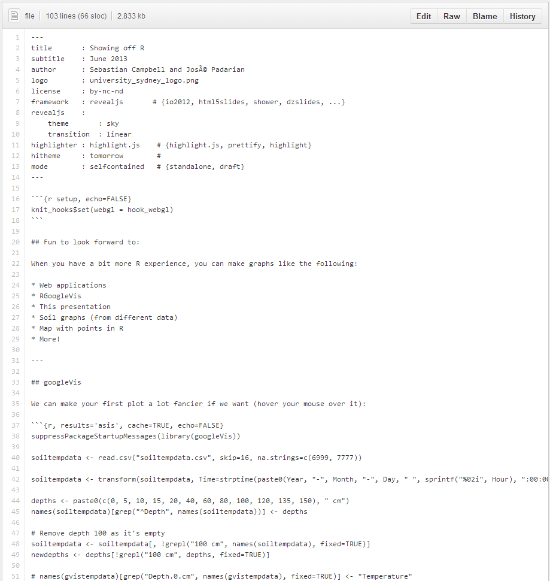

```{r setup, echo=FALSE}
knit_hooks$set(webgl = hook_webgl)
```

## Fun to look forward to:

When you have a bit more R experience, you can make graphs like the following:

* Web applications
* RGoogleVis
* This presentation
* Soil graphs (from different data)
* Map with points in R
* More!

---

## googleVis

We can make your first plot a lot fancier if we want (hover your mouse over it):

```{r, results='asis', cache=TRUE, echo=FALSE}
suppressPackageStartupMessages(library(googleVis))

soiltempdata <- read.csv("soiltempdata.csv", skip=16, na.strings=c(6999, 7777))

soiltempdata <- transform(soiltempdata, Time=strptime(paste0(Year, "-", Month, "-", Day, " ", sprintf("%02i", Hour), ":00:00"), tz="America/Anchorage", format="%Y-%m-%d %H:%M:%S"))

depths <- paste0(c(0, 5, 10, 15, 20, 40, 60, 80, 100, 120, 135, 150), " cm")
names(soiltempdata)[grep("^Depth", names(soiltempdata))] <- depths

# Remove depth 100 as it's empty
soiltempdata <- soiltempdata[, !grepl("100 cm", names(soiltempdata), fixed=TRUE)]
newdepths <- depths[!grepl("100 cm", depths, fixed=TRUE)]

# names(gvistempdata)[grep("Depth.0.cm", names(gvistempdata), fixed=TRUE)] <- "Temperature"

M <- gvisLineChart(soiltempdata, xvar="Time", yvar=newdepths, options=list(width=1000, height=500, lineWidth=0.5, vAxis="{title:'Temperature'}", hAxis="{title:'Time'}", title="Alaskan surface soil temperature"))

print(M, "chart")
```

---

## Soil profiles

Plot soil profiles with the help of package `aqp`:


---

## Georeferenced data

Plot soil profiles locations:



---

## Image processing



--- &vertical

## Shiny

<iframe src="http://glimmer.rstudio.com/sebastianc/bulk_density/" width=1024 height=768></iframe>

***

## More Shiny

<iframe src="http://glimmer.rstudio.com/sebastianc/variance_demonstration/" width=1024 height=768></iframe>

---

## Interactive 3D graphs

```{r testgl, webgl=TRUE}
library(rgl)
volc <- list(x=10*1:ncol(volcano), y=10*1:nrow(volcano), z=5*volcano)
surface3d(volc$y, volc$x, volc$z, terrain.colors(max(volcano))[volcano])
```
---

## This presentation!

This presentation was entirely made in R using some useful packages such as [slidify](http://slidify.org). You can look at the source for it on [GitHub](https://github.com/sebastian-c/r-aclep).



